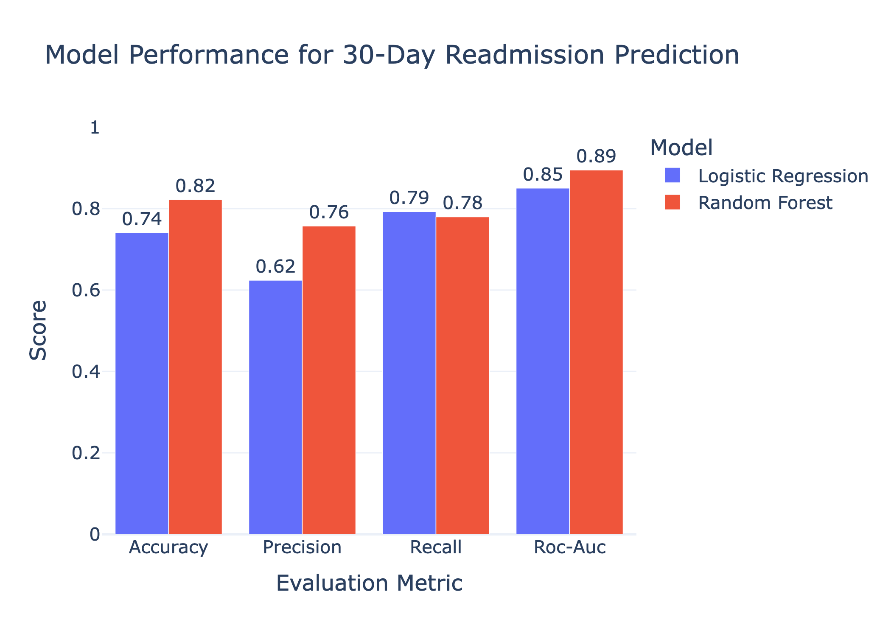

# Can Hospitals Predict Readmissions Before Patients Return?

## Hook

Hospital readmissions are expensive, disruptive, and often preventable. What if hospitals could identify higher-risk patients before discharge and intervene early?

## Problem Statement

Many hospitals struggle with patients returning soon after discharge, especially within 30 days. These readmissions can increase healthcare costs, strain hospital capacity, and signal gaps in follow-up care, medication management, or discharge planning.

Healthcare providers collect large amounts of patient information through electronic health records, including visit history, diagnoses, medications, and procedures. However, this data is often fragmented and underused when making discharge decisions.

This creates an important question: can routine patient data be used to predict which patients are most likely to be readmitted, allowing hospitals to focus support where it is needed most?

## Solution Description

To answer this, we built a predictive analytics pipeline using synthetic healthcare records stored in a MongoDB database.

Patient histories were organized into unified records containing encounters, conditions, medications, procedures, and observations. We then trained machine learning models to estimate whether a patient would return within 30 days of a prior encounter.

The strongest model, a Random Forest classifier, outperformed a traditional Logistic Regression baseline and achieved strong predictive performance. Key risk factors included prior hospital utilization, clinical complexity, and treatment intensity.

By identifying higher-risk patients before discharge, hospitals could use tools like this to prioritize care coordination, follow-up outreach, and transition planning.

## Chart

The Random Forest model outperformed Logistic Regression across key evaluation metrics, showing that machine learning can meaningfully improve short-term readmission prediction using routinely collected healthcare data.